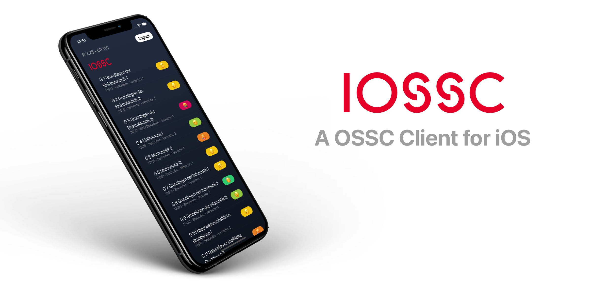

A iOS client application for retrieving your Grades from the OSSC servers.

This application works in conjunction with my node-ossc web server which recives and processes the grades page provided by the OSSC.
The Server then returns a developer friendly JSON object back to the client application. 

## Installation
These steps while help you to install a local version of this app on your device.

1. Download Xcode from the Mac App Store.
2. Once installed you should be able to open the `iOSSC.xcodeproj` file. Alternativly you can press the green download button at the root of this repository and hit `Open with Xcode`.
3. Once opened up you should be presented with the application's code. Go ahead and select the upper most item from the list on the left `iOSSC`.
4. Under `Targets > iOSSC` select `Signing & Capabilites` you there have to "sign" your application with your personal Apple id.
5. Add a valid Sentry DSN environment variable. `SENTRY_DSN`
6. Once the application has been signed you can choose either a simulator or a real physical device from the dropdown menu next to the status bar on the top.
7. Hit the play button and the application should start running.

## API
By default the App uses my server to scrape the OSSC website. If you want more security you can easly host your own version of this API server (Free of Charge if you use a service like Heroku).
Checkout: https://github.com/KuhlTime/hsd-ossc-api

## Feedback
In case you find any issues with the application let me know. andre.kuhlmann@study...
